# MOVIE TICKET BOOKING SYSTEM

My project primarily manages the process of booking movie tickets at a theater, providing a user-friendly interface for easier ticket booking. The project progresses through a series of carefully designed forms, equipped with validation functions to ensure consistency, reliability, and most importantly, the accuracy of the information fed into the database.

## WORKING APPLICATION

Check out the **live demo** -> https://mtk-cinema.vercel.app/

## SOLUTION DESIGN

I have integrated various user interface widgets to enhance the result screen, making it easier for users to navigate the application without confusion. The overall architecture of the application can be considered to have two main parts:

- **The user side** (Done)

- **The admin side** (In Progress)

### The user side :

#### 1. Home Screen

This is Modal the user will see when he opens the application or `npm start`

##### 1.1 Login

- If the user is using the application for the first time, they can click on **Đăng ký** and register their personal information. Otherwise, they can log in using their credentials and proceed.

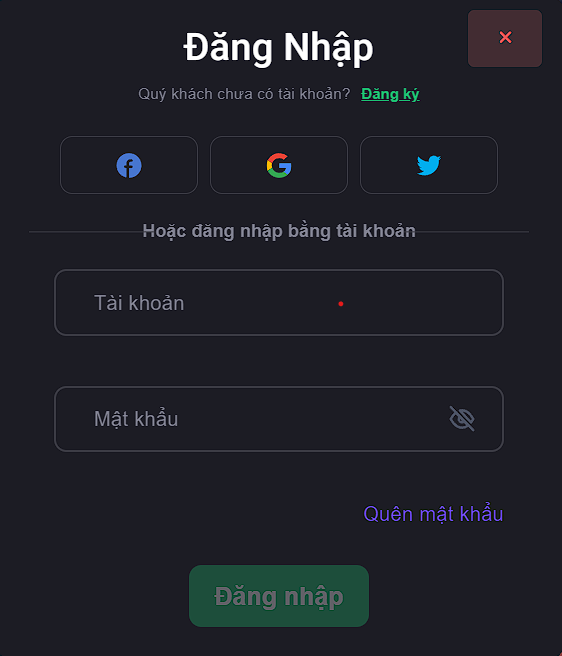

##### 1.2 Register

- This Modal is for users who are using the app for the first time . Here users can register using his/her email id and password.

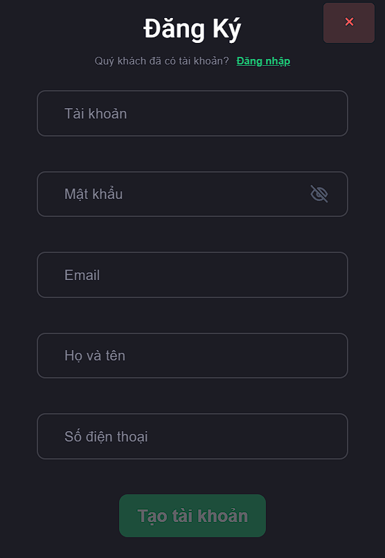

##### 1.3 Booking movie

- This is the place where users can book movie tickets based on the information provided by the user, such as the movie name, cinema group, show date, and showtime.After filling in all the necessary information, click the **Đặt vé** button.
  

##### 1.4 Movie categories

- Here, users can search for suitable movies and find information about those movies based on available movie categories.
  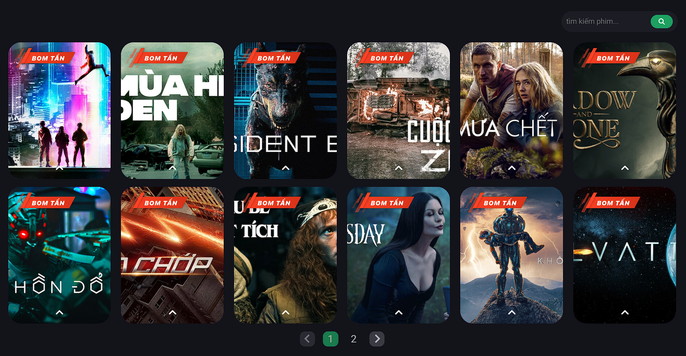

##### 1.5 The category of cinema systems

- This is the place where users can search for movie information by individual cinema groups.
  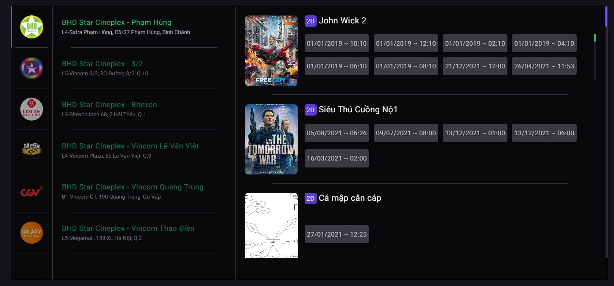

#### 2. Booking Movie Screen

##### 2.1 Seat selection

- On this, there is a grid of seats similar to those in a movie theater. Users will need to select seats of their preference from the available seats.
  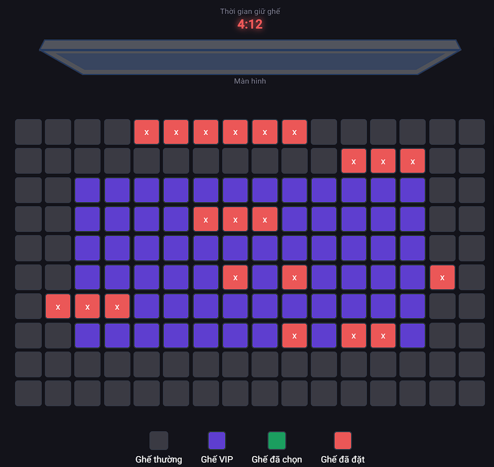

##### 2.2 Buy Combo

- This screen appears when the user clicks the "buy combo" button. Here, users can choose a suitable combo and the desired quantity.
  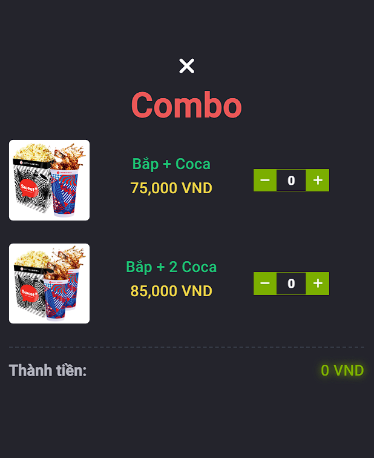

##### 2.3 Payment

- This section allows users to review the details of the selected movie and choose a suitable payment method. After selecting seats and a payment method, users can click the **Thanh toán** button to book their tickets.
  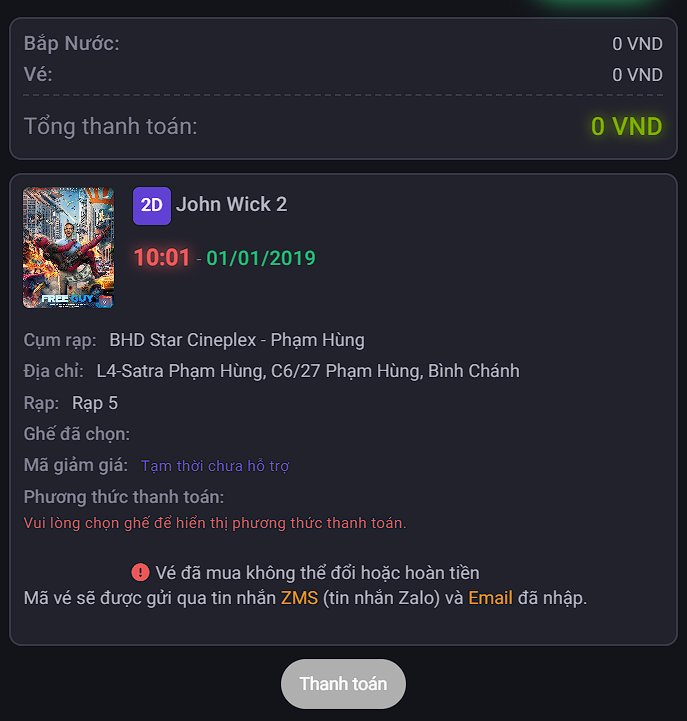

#### 3. Profile Screen

This screen appears when the user clicks the **tài khoản** button.
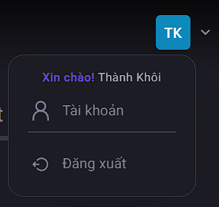

##### 3.1 Account infomation

- Here, users can view their personal account information, booking history, and can update their personal information.
  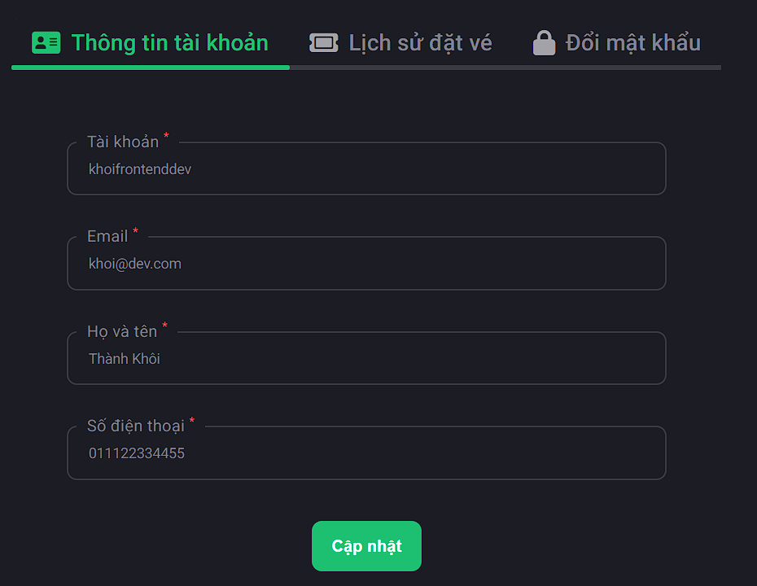
  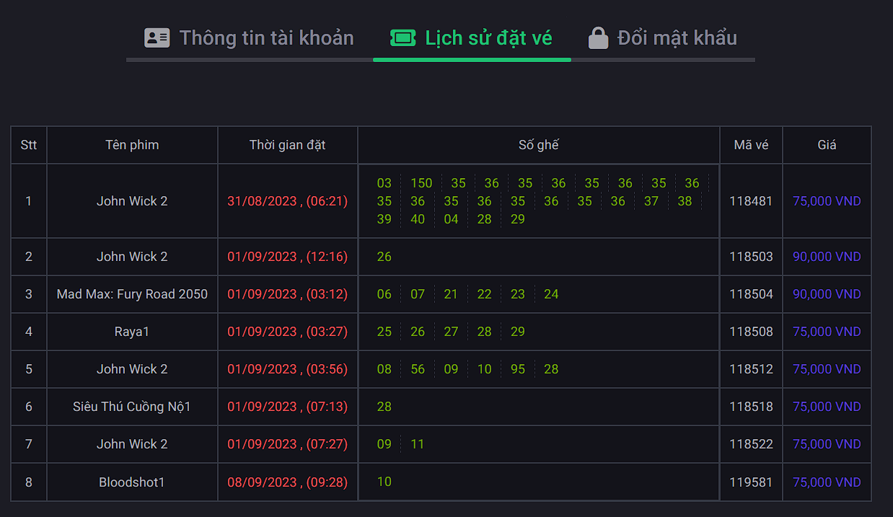
  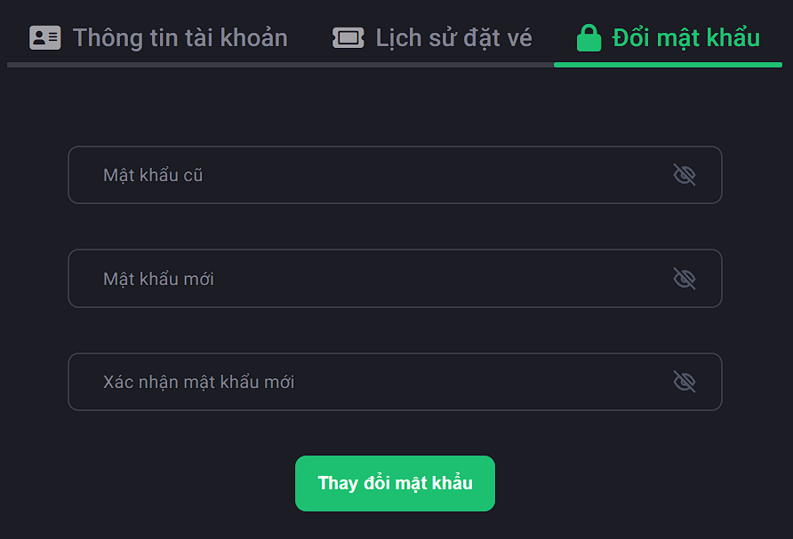
